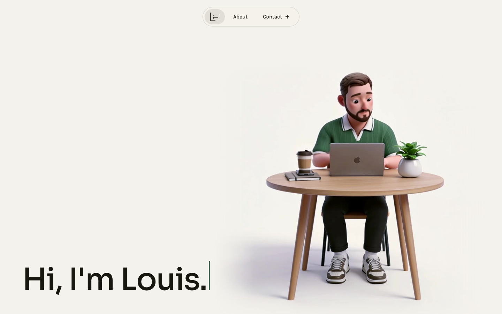

# Louis Freeman

The personal portfolio of Louis Freeman, a senior full stack engineer in London: a Rails 8 API serving a React 19 single-page app.

**Live site: [louisfreeman.co.uk](https://louisfreeman.co.uk)**



## About the site

Three pages, each designed at 1440px and 390px:

- **Home:** a hero with a looping video and a typed greeting, a scroll-driven experience deck, a selected work section and a "What I do" section with a stack ticker. Sections stack over each other like cards as you scroll.
- **About:** a pinned conversation intro that glides in with scroll, hobbies, and a "Where I've been" timeline.
- **Work:** sticky-stacked case-study cards. The page stays hidden (and returns 404) until at least one case study is published.

All copy lives in the database, seeded from `db/seeds/content.json`, so text changes need no component changes.

## Tech stack

| Area | Choice |
|---|---|
| Back end | Ruby on Rails 8 (JSON API under `Api::V1`, plus HTML page shells) |
| Database | PostgreSQL |
| Front end | React 19 + TypeScript, bundled by Vite through `vite_rails` |
| Routing and data | React Router, React Query, and `js-routes` for typed path helpers |
| Styling | Plain CSS: design tokens in `tokens.css` plus per-component CSS modules. No UI kit |
| Tests | RSpec (models, requests, serializers), Capybara with Cuprite (system specs in headless Chrome), Vitest with Testing Library |
| Analytics | Umami Cloud, cookieless |
| Hosting | Render, from the blueprint in `render.yaml` |

## Architecture

```
Browser ── GET /, /about ──▶ PagesController (HTML shell)
                              └─ meta, Open Graph, JSON-LD, and a bootstrap JSON block with the page's data
React SPA ── React Router ── features/home | about | work
    └─ React Query (initialData from the bootstrap) ── GET /api/v1/{profile,home,work,about} ──▶ Api::V1 controllers
                                                              └─ page serializers composed from section serializers
```

- **API controllers under `Api::V1`.** One read-only singular resource per page (`home`, `work`, `about`) plus `profile` for the shared nav and footer. Errors use one JSON envelope, and successful responses are cacheable for five minutes.
- **Page shells with bootstrap JSON.** Each route is served by Rails with its own title, description, canonical URL, Open Graph tags and structured data. The shell embeds the exact API payloads the page needs, and React Query uses them as `initialData`, so the first load needs no extra requests and shows no spinner.
- **One table per section.** Each page section has its own model and table. Plain-Ruby serializers per section are composed into page serializers, and both the API and the page shells use them.
- **Shared JSON Schema contracts.** The API response shapes and the bootstrap block are JSON Schemas in `spec/contracts/`. RSpec request specs and Vitest fixtures validate against the same files, so the front end and back end can't drift apart unnoticed.
- **Feature-based front end.** `app/javascript/` is organised by feature (`features/home`, `features/about`, `features/work`, each with its own components, hooks and API modules), with shared UI in `components/`, hooks in `hooks/`, and the API client, analytics and helpers in `lib/`.

## Highlights

- **Accessibility and performance:** Lighthouse mobile scores of 100 for accessibility and the mid-90s for performance on a production build. Keyboard-operable deck and menus, visible focus rings, a skip link, and no axe violations.
- **Reduced motion:** with `prefers-reduced-motion`, every scroll effect and animation switches off, and the hero shows a still poster instead of the video.
- **Cookieless analytics:** Umami counts page views, contact-link clicks and case-study views without cookies or any storage on the device, so there's no consent banner.
- **SEO:** per-page meta and Open Graph tags, `Person` and `WebSite` structured data, a sitemap, `robots.txt` and a default share image.

## Getting started

### Prerequisites

- Ruby 4.0.7 (see `.ruby-version`) and Node 24.21.0 (see `.node-version`), for example through `mise`
- PostgreSQL 18
- Google Chrome, for the system specs

### Setup

```sh
bin/setup
```

This installs gems and npm packages, prepares and seeds the database, generates the `js-routes` helpers and starts the development server. Add `--skip-server` to stop before starting it.

To start the app later:

```sh
bin/dev
```

This runs Rails on port 3000 and the Vite dev server together (see `Procfile.dev`).

### Environment variables

The database connection uses the standard libpq variables, so set whichever you need. `.env.example` lists them:

| Variable | Purpose |
|---|---|
| `DATABASE_URL` | Database connection string (required in production) |
| `PGHOST`, `PGPORT`, `PGUSER`, `PGPASSWORD` | Local PostgreSQL connection settings |

Optional:

| Variable | Purpose |
|---|---|
| `UMAMI_WEBSITE_ID` | Turns on the Umami script. Without it, no analytics script is rendered |
| `CANONICAL_ORIGIN` | Origin used for canonical URLs and share links (defaults to `https://louisfreeman.co.uk`) |

## Testing and linting

Run everything CI runs, in the same order:

```sh
bin/ci
```

Or run the pieces on their own:

| Check | Command |
|---|---|
| RSpec (models, requests, system specs) | `bundle exec rspec` |
| Vitest | `npm test` |
| RuboCop | `bundle exec rubocop` |
| ERB lint | `bundle exec erb_lint --lint-all` |
| ESLint | `npm run lint` |
| Prettier | `npm run format:check` |
| TypeScript | `npm run typecheck` |
| YAML key order | `bin/lint-yaml-keys` |
| Spec requires | `bin/lint-spec-requires` |
| Security | `bin/brakeman`, `bin/bundler-audit check --update`, `npm audit --omit=dev` |

`bin/ci` also rolls every migration back and forward, redoes each one, and checks that `db/schema.rb` still matches.

## Deployment

The app deploys to Render from the blueprint in `render.yaml`: a web service and a PostgreSQL database in Frankfurt. Render deploys `main` once the GitHub checks pass. The build (`bin/render-build.sh`) installs dependencies, precompiles assets, prepares the database and runs the seeds. `SECRET_KEY_BASE` is generated by the blueprint and `DATABASE_URL` comes from the database, so no secrets need to be committed.

### Publishing work

The Work page stays dormant until at least one case study exists. Until then the nav has no Work link, `/work` and `/api/v1/work` return 404, the sitemap leaves `/work` out, and Home shows a coming-soon card in Selected work. To publish, add entries to `work.caseStudies` in `db/seeds/content.json` (each needs `id`, `slug`, `title`, `years`, `headline`, `description`, `role` and a `diagramKey` of `cards`, `identity`, `tax` or `ai`) and re-seed.

## Project structure

```
app/
  controllers/        Page shells, sitemap, robots, and Api::V1 controllers
  models/             One model per content section
  serializers/        Section, page, item and structured-data serializers
  views/              Page shell layout, sitemap and robots templates
  javascript/
    app/              Router, providers and layout
    features/         home, about and work, each with components, hooks and api modules
    components/       Shared UI (nav, footer, buttons, cards)
    hooks/            Shared hooks (reduced motion, media queries, scroll stacking)
    lib/              API client, analytics, js-routes helpers
    styles/           Design tokens and base styles
config/               Rails config, locales (UI copy lives in en.yml) and CI steps
db/                   Migrations, schema and content seeds
lib/                  Content seeder and middleware
public/               Error pages, favicons, hobby images and the share image
spec/                 RSpec suites, JSON Schema contracts and Vitest helpers
render.yaml           Render blueprint
```

## Licence

All rights reserved.
